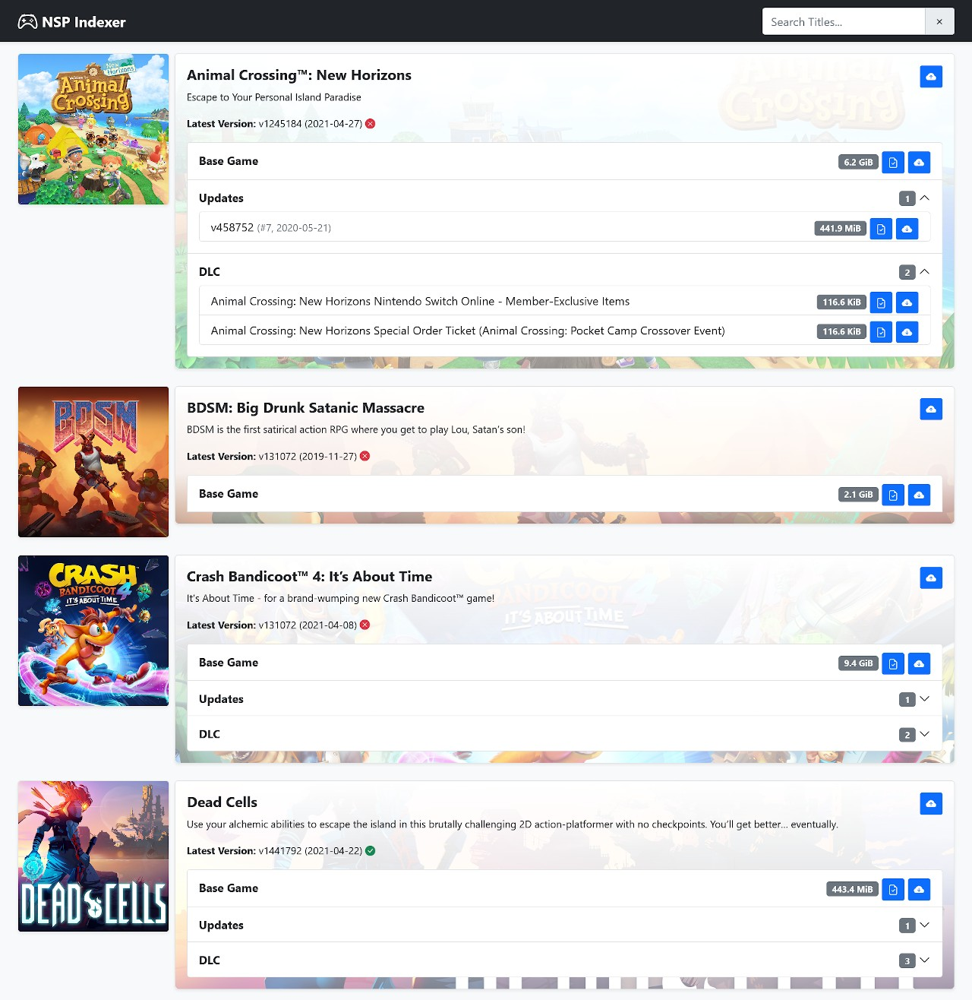

# NSP Indexer
> PHP Indexer for Switch NSP (XCI NSZ XCZ) by proconsule and jangrewe

# How To

Place all files into a directory on your webserver, then copy `config.defaults.php` to `config.php` and adjust it to your needs.

Your filenames need to contain at least a Title ID in the format `[0100XXXXXXXXYYYY]`, and Updates also need a version tag like `[v1441792]`.

Hope you enjoy it!

# Features
- List NSP, XCI, NSZ and XCZ titles in a fancy way (Base Games, DLCs and Updates)
- Check For latest Update version of game file (if any)
- Compatible with tinfoil Custom Index JSON (if called with `index.php/?tinfoil`)
- Compatible with DBI plaintext list (if called with `index.php/?DBI`)
- Net Install (if TCP port 2000 of Switch is reachable by webserver)
- NSP Internal TitleID Check
- XCI Internal TitleID Check (if keys supplied)
- NCA Control File Decryption (very fast if php have ssl support)
- File Rename Based on TitleID & Version

# Known Issue
- 32Bit System suffer for >2GB limit in many way (filesize fseek and so on) so some features are not working (on files >2GB) like FileSize and Rom Info

# Thanks to
- SciresM for aes128.py we ported to PHP for NCA decryption
- duckbill007 for support on DBI Installer
- blawar for nsp update version look suggestion and all tinfoil cool stuff
